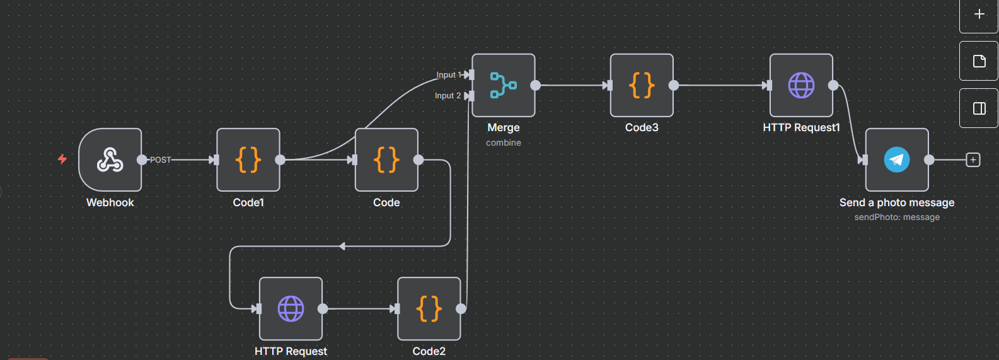

# Real-Time Chess Best Move Analyzer with Telegram Image Updates

Get an instant best-move preview for your ongoing Lichess games. This project polls your Lichess account, sends the current FEN to an n8n workflow, fetches a Stockfish move, applies that move to the FEN, renders a board image of the resulting position, and delivers it to you on Telegram.

 
   

## Description
This project enables real-time chess move analysis by integrating game state tracking, best move computation, and instant notifications via Telegram. It is designed for scenarios like live games on Lichess, where both the current board position (FEN) and the engine’s best move are received asynchronously. The workflow merges these inputs, calculates the resulting position after the recommended move, and sends the move to the user as a visual board image on Telegram.

## Features
- **Live FEN Input**: Receives real-time chess board states from an external script via n8n Webhook.
- **Best Move Recommendation**: Uses a chess engine (e.g., Stockfish) to calculate optimal moves.
- **Asynchronous Input Handling**: Merges separately arriving FEN and move data into a single event before processing.
- **Position Update**: Generates the new FEN after applying the move.
- **Visual Output**: Sends the best move as a board image to Telegram for quick and clear feedback.
- **Automation with n8n**: Handles data flow, timing, and communication between all components.

## Workflow Overview
1. **Webhook Trigger** – Receives incoming FEN or best move from the external source.
2. **Merge Node** – Waits for both FEN and best move to arrive, combining them for processing.
3. **JavaScript Function** – Applies the move to the original FEN and generates the new FEN.
4. **Image Generation** – Creates a chessboard image showing the best move.
5. **Telegram Node** – Sends the move image to the user in real time.

## Requirements
- **n8n** (self-hosted or cloud)
- **Stockfish** (or any UCI-compatible chess engine)
- **External script** to send FEN and moves to the webhook
- **Telegram Bot Token** for sending updates
- **Chess image generator** (e.g., using a public API or local tool)

## Example Use Case
During a live online chess game, the script continuously sends the current board position every few seconds to n8n. The engine calculates the best move for that position, and within seconds, the user receives an image on Telegram showing the recommended move on the board.

## Benefits
- Real-time feedback for better decision-making.
- Clear visual representation of moves.
- Fully automated workflow with minimal manual intervention.

## Possible Improvements
- Add move evaluation scores.
- Include multiple move suggestions.
- Log past positions and moves for game review.
